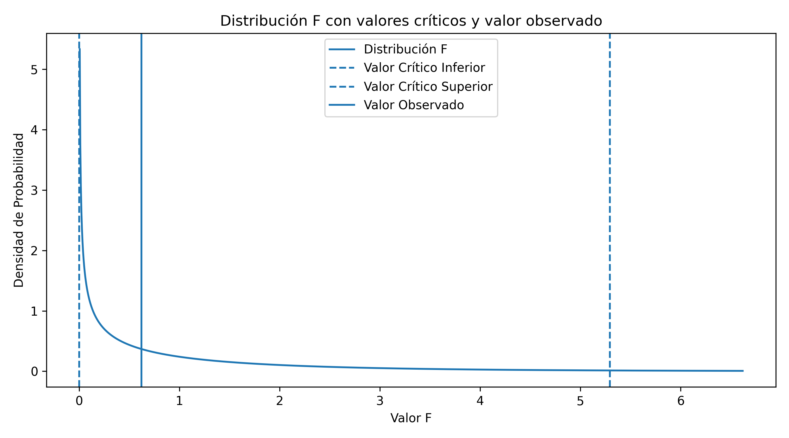

## HU-2.2 – Condiciones de aplicación del test t para la diferencia de medias

Antes de aplicar el test t para contrastar la igualdad de medias entre la anchura craneal del periodo predinástico temprano y tardío, es necesario analizar las condiciones bajo las cuales este contraste es válido.

### 1. Independencia de las muestras

El test t para dos muestras independientes requiere que las observaciones de cada grupo sean independientes entre sí y que no exista relación entre los valores de una muestra y los de la otra.

En este estudio, se asume de forma natural la independencia entre ambas muestras, ya que los cráneos pertenecen a individuos distintos y a periodos históricos diferentes. Además, el propio enunciado del ejercicio indica explícitamente que esta condición no es necesario comprobarla.

Por tanto, la condición de independencia se considera satisfecha.

---

### 2. Normalidad de las poblaciones

Otra condición fundamental del test t es que las poblaciones de las que proceden las muestras sigan una distribución normal.

La normalidad de ambas submuestras se evaluó mediante tres contrastes complementarios: **Kolmogorov–Smirnov (KS)**, **Shapiro–Wilk** y **Lilliefors**. Los resultados obtenidos indicaron que:

- En la submuestra correspondiente al **periodo predinástico temprano**, los tres tests rechazan la hipótesis nula de normalidad (\(p < 0.05\)).
- En la submuestra correspondiente al **periodo predinástico tardío**, el test KS no rechaza la normalidad, mientras que Shapiro–Wilk y Lilliefors sí la rechazan.

Dado que Shapiro–Wilk y Lilliefors son más potentes y adecuados cuando los parámetros de la distribución normal se estiman a partir de la muestra, se adopta una interpretación prudente y se concluye que **no puede asumirse normalidad estricta en ninguna de las dos submuestras**.

Por tanto, la condición de normalidad no se cumple de manera estricta para las poblaciones analizadas. No obstante, el test t es relativamente robusto frente a desviaciones moderadas de la normalidad, especialmente cuando los tamaños muestrales son similares y no muy pequeños.

---

### 3. Igualdad de varianzas

El test t clásico para la diferencia de medias asume que ambas poblaciones tienen la misma varianza (homocedasticidad).

Para evaluar esta condición se aplicó el **test de Levene**, que es más robusto frente a desviaciones de la normalidad que otros contrastes clásicos.

Los resultados obtenidos fueron:

- Tamaño muestral periodo predinástico temprano: \(n = 30\)  
- Tamaño muestral periodo predinástico tardío: \(n = 30\)  
- Estadístico de Levene: 0.6195  
- p-valor: 0.4344  

Dado que el p-valor es superior al nivel de significación considerado (\(p > 0.05\)), no se rechaza la hipótesis nula de igualdad de varianzas. Por tanto, la homocedasticidad puede considerarse plausible.

### 3.1 Comprobación gráfica de la homocedasticidad mediante la distribución F

Antes de aplicar contrastes paramétricos de comparación de medias, es necesario verificar el cumplimiento del supuesto de **homocedasticidad**, es decir, la igualdad de varianzas entre los grupos analizados. Este supuesto es fundamental para garantizar la validez de pruebas como el test *t* de Student o el análisis de la varianza (ANOVA).

Para este fin, se ha empleado el **test de Levene**, un contraste robusto frente a desviaciones de la normalidad, especialmente adecuado en contextos donde dicho supuesto no puede garantizarse plenamente. El test de Levene evalúa la hipótesis nula de igualdad de varianzas entre los grupos frente a la alternativa de varianzas diferentes.

Además del resultado numérico del contraste, se presenta una **representación gráfica del estadístico de prueba en el contexto de su distribución teórica**. La Figura X muestra la distribución F bajo la hipótesis nula de homocedasticidad, junto con el valor crítico correspondiente al nivel de significación establecido y el valor observado del estadístico.

La curva representada corresponde a la **distribución F teórica** definida por los grados de libertad asociados al contraste. La línea vertical discontinua indica el **valor crítico superior**, que delimita la región de rechazo para el nivel de significación considerado, mientras que la línea vertical continua representa el **valor observado del estadístico de Levene** obtenido a partir de las muestras.

Dado que el test de Levene es un **contraste unilateral**, la región crítica se sitúa exclusivamente en la **cola derecha** de la distribución. En este caso, el valor observado se encuentra claramente dentr

---

### 4. Decisión metodológica

A pesar de que la condición de normalidad no se cumple estrictamente en ninguna de las submuestras, se procede a realizar el contraste de hipótesis para la diferencia de medias mediante el **test t de Welch**, tal y como se indica explícitamente en el enunciado del ejercicio.

Esta decisión se justifica por:
- La independencia entre las muestras.
- La robustez del test t (y en particular de Welch) frente a desviaciones moderadas de la normalidad.
- La igualdad aproximada de tamaños muestrales.
- La coherencia esperada con los intervalos de confianza obtenidos.

No obstante, los resultados del contraste deberán interpretarse con cautela y complementarse, cuando proceda, con una **alternativa no paramétrica** (por ejemplo, el test de Mann–Whitney), con el fin de reforzar la validez de las conclusiones inferenciales.

---

### 5. Implicaciones metodológicas

El cumplimiento de la condición de homocedasticidad (test de Levene: p = 0.4344 > 0.05) permitiría, en principio, la aplicación del test t clásico para la diferencia de medias. No obstante, dado que la condición de normalidad no se cumple estrictamente en ninguna de las submuestras (Shapiro–Wilk y Lilliefors rechazan normalidad), se opta por mantener el uso del **test t de Welch** en el contraste de hipótesis posterior, que no asume varianzas iguales y es más robusto frente a desviaciones de la normalidad.

Esta decisión garantiza una mayor robustez del análisis inferencial y resulta coherente con los supuestos observados en los datos. Además, se recomienda complementar los resultados con el test de Mann–Whitney como contraste no paramétrico alternativo para reforzar la validez de las conclusiones.

