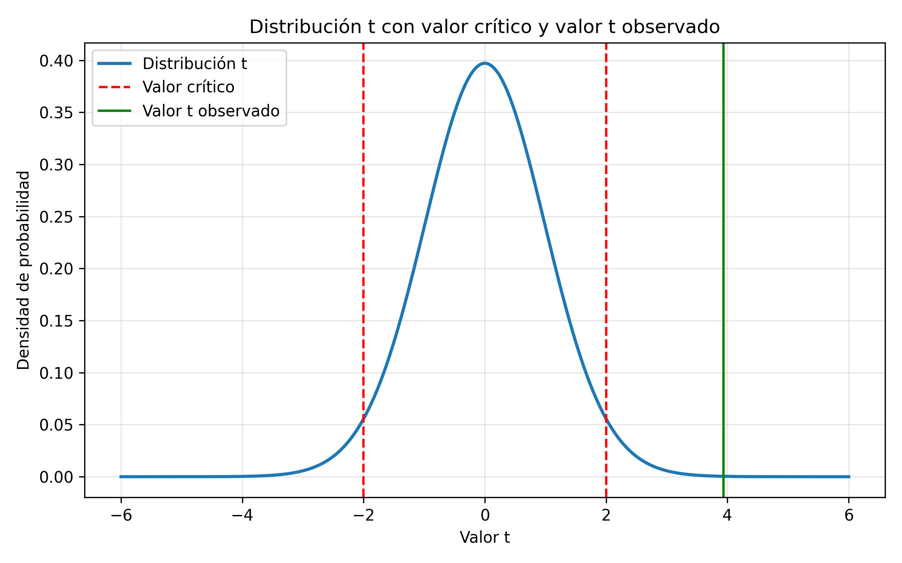

## HU-2.2 – Contraste de hipótesis mediante el test t

Con el objetivo de contrastar si la anchura media del cráneo difiere entre los periodos predinástico temprano y predinástico tardío, se aplicó un test t para dos muestras independientes utilizando la corrección de Welch, que no asume igualdad de varianzas y es más robusto frente a desviaciones de la normalidad.

---

### Planteamiento del contraste

Se consideraron las siguientes hipótesis:

- **Hipótesis nula (H₀):**  

  $\mu_{tardío} = \mu_{temprano}$
  

- **Hipótesis alternativa (H₁):**  

  $\mu_{tardío} \neq \mu_{temprano}$

El contraste se realizó con un nivel de significación \(\alpha = 0.05\).

---

### Resultados del contraste

El test t de Welch proporcionó los siguientes resultados:

- **Estadístico t:** 3.9354  
- **p-valor:** 0.000233  

Dado que el p-valor obtenido es muy inferior al nivel de significación considerado (\(p = 0.000233 < 0.05\)), se rechaza la hipótesis nula de igualdad de medias.

### Representación gráfica del test *t* de Welch

Con el objetivo de reforzar la interpretación del contraste de hipótesis realizado mediante el test *t* de Welch, se incluye una representación gráfica de la distribución teórica del estadístico *t* bajo la hipótesis nula de igualdad de medias.

La Figura muestra la distribución *t* de Student correspondiente a los grados de libertad ajustados del test de Welch. Las líneas verticales discontinuas representan los valores críticos asociados a un contraste bilateral con un nivel de significación \(\alpha = 0.05\), delimitando la región crítica del contraste. La línea vertical continua indica el valor *t* observado obtenido a partir de los datos muestrales.

Se observa que el valor *t* observado se sitúa claramente fuera de la región de aceptación de la hipótesis nula, en una de las colas de la distribución. Este resultado indica que la probabilidad de obtener una diferencia de medias tan extrema bajo la hipótesis de igualdad es muy reducida. En consecuencia, se rechaza la hipótesis nula, concluyéndose que existen diferencias estadísticamente significativas entre las medias de los periodos analizados.

Cabe destacar que esta representación gráfica no se basa en la distribución empírica de los datos originales, sino en la distribución teórica del estadístico *t* bajo la hipótesis nula, incorporando los grados de libertad ajustados propios del test de Welch. De este modo, la visualización complementa el contraste numérico y refuerza la interpretación inferencial de los resultados obtenidos.

---

### Interpretación estadística

El resultado del contraste indica la existencia de diferencias estadísticamente significativas entre las medias de la anchura craneal en los periodos predinástico temprano y predinástico tardío.

Este resultado es plenamente coherente con el análisis de intervalos de confianza realizado en el apartado anterior, en el que el valor cero no estaba incluido en ninguno de los intervalos considerados, reforzando así la evidencia de una diferencia real entre ambos periodos históricos.

---

### Discusión de la validez del contraste

Aunque el test t asume normalidad poblacional, el contraste se ha realizado a pesar de que una de las submuestras no cumple estrictamente esta condición, tal y como se indicó en el análisis previo de normalidad. No obstante, el uso del test t de Welch, junto con la homocedasticidad observada mediante el test de Levene y la coherencia con los intervalos de confianza, sugiere que las conclusiones obtenidas son razonablemente robustas.

Por tanto, los resultados del contraste pueden considerarse válidos dentro del contexto del estudio, siempre que se interpreten teniendo en cuenta las limitaciones señaladas.
